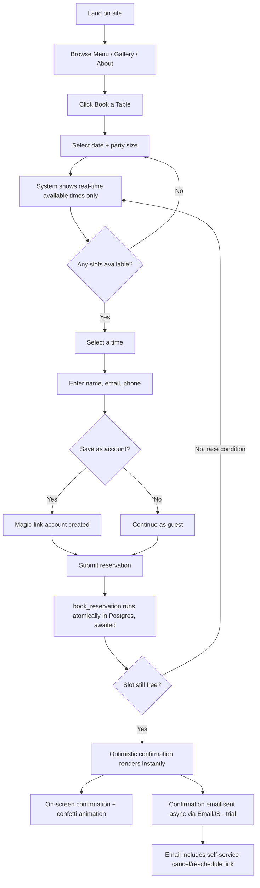
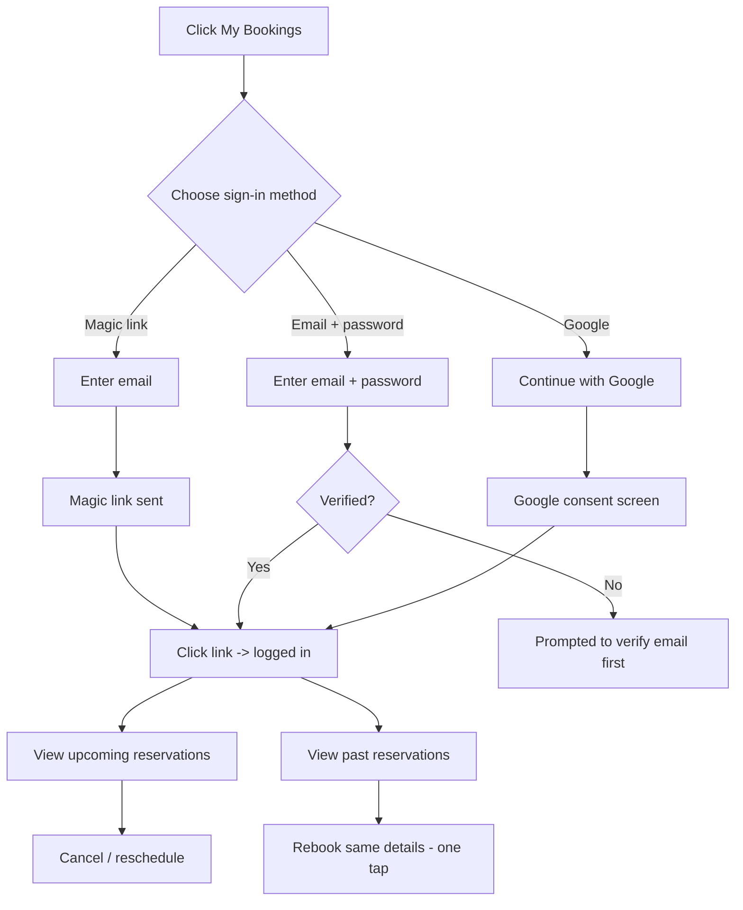
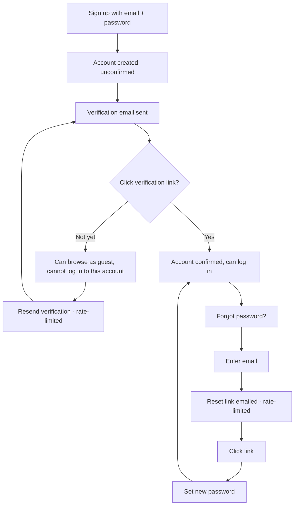
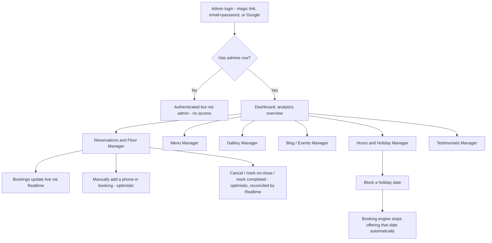
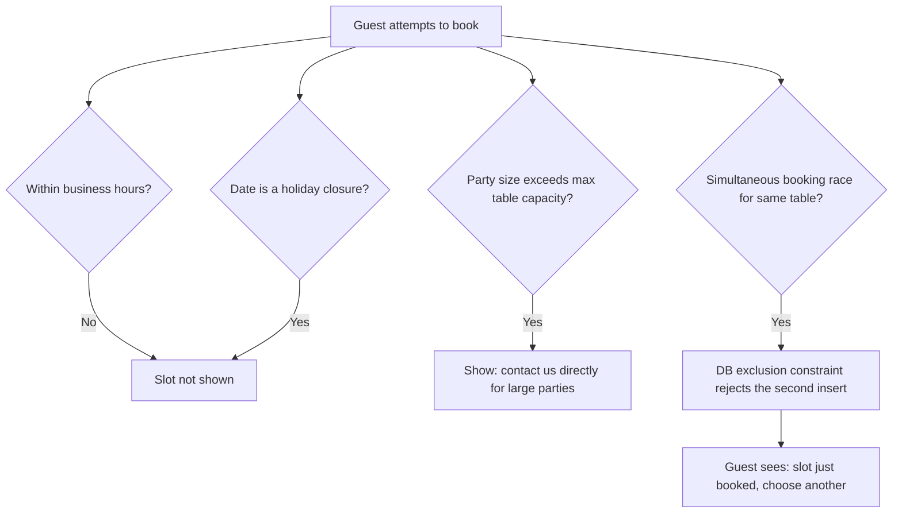

# TableCraft — User Flow / App Flow

| Field | Value |
|---|---|
| Version | 1.0 |
| Date | July 23, 2026 |

This document maps every primary journey through the app. Diagrams use Mermaid (renders natively on GitHub, Notion, and most markdown viewers).

---

## 1. Guest Reservation Flow (Primary Flow — Guest Booking)

**Narrative:**
1. Guest lands on the site (direct, search, or social) and browses Menu / Gallery / About
2. Guest clicks **Book a Table**
3. Guest selects a date and party size
4. The system queries real-time availability and shows only bookable time slots (closed hours, holidays, and fully-booked slots are simply never shown — no dead ends)
5. Guest selects a time
6. Guest enters name, email, and phone (no account required)
7. Guest is offered the option to save these details as a lightweight account (magic-link, no password) for faster rebooking later
8. On submit, the `book_reservation` function runs (`await`ed) as a single atomic database transaction, re-validating availability and auto-assigning the best-fit table
9. If the slot is still free: reservation confirms **instantly** — no owner approval step. The confirmation screen renders **optimistically** the moment the RPC resolves, without waiting on the email to send
10. Guest sees an on-screen confirmation (with the signature confetti micro-animation, clear text labels throughout — not icon-only) and a confirmation email is fired asynchronously via EmailJS (trial email provider) with a self-service cancel/reschedule link
11. If, in the rare case, someone else grabbed the last table in the milliseconds between step 4 and step 8, the optimistic confirmation is rolled back and the guest is shown an updated set of available times instead of a broken confirmation

## 2. Returning Customer Flow

**Narrative:** A guest who previously saved an account can log back in via any of the three methods (magic link, email+password, or Google OAuth) to see upcoming and past reservations, cancel/reschedule, or rebook the same details in one tap.

## 2a. Sign-Up, Email Verification & Forgot Password Flow

**Narrative:** Covers the email+password path specifically, since it's the only one of the three methods with its own verification and reset steps — magic link and Google are self-verifying by construction (§4 Edge Cases).

## 3. Admin Flow

**Narrative:** The owner logs into a separate admin area. The dashboard gives an at-a-glance analytics view, and every content type (menu, gallery, blog/events, testimonials, hours) is independently manageable. Every list view (reservations, gallery, blog/events, testimonials) loads in paginated pages rather than the whole table at once, and every row action (edit, delete, cancel, no-show, complete) is a labeled control, not a bare icon, with a tooltip for the ones that stay icon-first for space. The reservations screen updates live as bookings come in, thanks to Supabase Realtime, and manual actions (cancel/no-show/complete/phone-in booking) reflect on screen optimistically, then reconcile against the Realtime event.

## 4. Edge Cases

| Scenario | System behavior |
|---|---|
| Slot outside business hours | Never shown as an option in the first place |
| Date is a blocked holiday | Never shown as an option in the first place |
| Party size exceeds the largest available table | Booking form shows: "For parties over [max size], please contact us directly" with phone/email |
| Two guests race for the last table at the same instant | Database exclusion constraint guarantees only one insert succeeds; the second guest sees a refreshed (now-unavailable) slot list, never a false confirmation |
| Guest cancels via email link | Table is released back into the availability pool immediately; admin's live reservations view updates in real time |
| Guest lets a magic-link email sit unused | Link expires per Supabase Auth defaults; guest can request a new one |
| Email+password account not yet verified | Can't log in to that account (guest booking still works); prompted to verify, with a rate-limited resend option |
| Someone authenticates (any method, including Google) but has no `admins` row | Treated as a regular authenticated user, not an admin — no admin routes are reachable |
| Repeated magic-link / verification / password-reset requests | Rate-limited per email/IP; person sees a plain-text "try again in a moment" rather than a silent block |
| Visitor declines non-essential cookies | Site remains fully usable (booking flow doesn't depend on non-essential cookies); only analytics/embeds that need consent are withheld |

