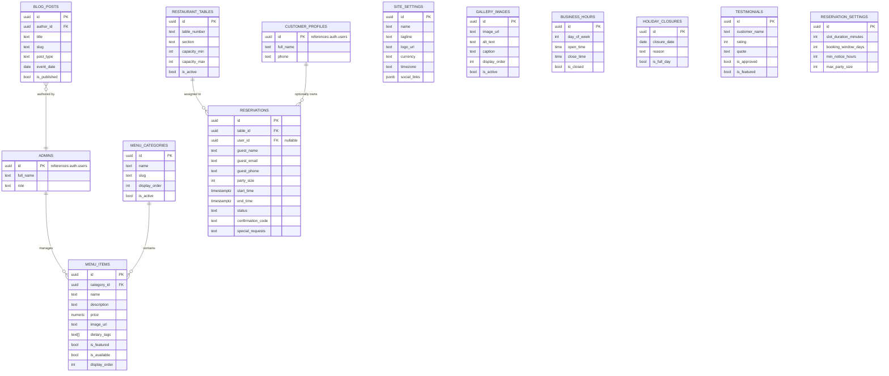

# TableCraft — Backend Schema (Supabase / Postgres)

| Field | Value |
|---|---|
| Version | 1.0 |
| Date | July 23, 2026 |
| Model | Single-tenant per deployment (one Supabase project per client) |

---

## 1. Entity-Relationship Overview



## 2. Table Specifications

### `site_settings` (singleton — one row per deployment)
| Column | Type | Notes |
|---|---|---|
| id | uuid PK | |
| name | text | Brand name, e.g. "Crumb & Confetti" |
| tagline | text | |
| logo_url | text | |
| description | text | |
| phone, email | text | |
| address, city, country | text | |
| timezone | text | e.g. `America/New_York` |
| currency | text | Default `USD` — config, not hardcoded |
| social_links | jsonb | `{ instagram, facebook, ... }` |

### `admins`
| Column | Type | Notes |
|---|---|---|
| id | uuid PK, FK → `auth.users.id` | Same row regardless of how the admin signed in (magic link, email+password, Google OAuth) — Supabase Auth resolves all three to one `auth.users.id`, so this table needs no `auth_provider` column |
| full_name | text | |
| role | text | `owner` \| `staff` (staff scoping is P2, see PRD) |

### `customer_profiles` (optional accounts)
| Column | Type | Notes |
|---|---|---|
| id | uuid PK, FK → `auth.users.id` | Created only if guest opts in at booking time, via any of the three sign-up methods (TRD §4.2) |
| full_name | text | |
| phone | text | |

### `menu_categories`
| Column | Type | Notes |
|---|---|---|
| id | uuid PK | |
| name, slug | text | |
| display_order | int | |
| is_active | bool | |

### `menu_items`
| Column | Type | Notes |
|---|---|---|
| id | uuid PK | |
| category_id | uuid FK → menu_categories | |
| name, description | text | |
| price | numeric(10,2) | |
| image_url | text | |
| dietary_tags | text[] | e.g. `{vegan, gluten-free}` |
| is_featured, is_available | bool | |
| display_order | int | |

### `gallery_images`
| Column | Type | Notes |
|---|---|---|
| id | uuid PK | |
| image_url | text | Supabase Storage path |
| alt_text | text | **Required at upload** — CMS enforces this, not optional |
| caption | text | |
| display_order | int | |
| is_active | bool | |

### `restaurant_tables`
| Column | Type | Notes |
|---|---|---|
| id | uuid PK | |
| table_number | text | |
| section | text | e.g. "Patio", "Main Hall" |
| capacity_min, capacity_max | int | Used by the best-fit assignment logic |
| is_active | bool | |

### `business_hours`
| Column | Type | Notes |
|---|---|---|
| id | uuid PK | |
| day_of_week | int (0–6) | |
| open_time, close_time | time | |
| is_closed | bool | Whole day closed (e.g. Mondays) |

### `holiday_closures`
| Column | Type | Notes |
|---|---|---|
| id | uuid PK | |
| closure_date | date | |
| reason | text | |
| is_full_day | bool | |
| closed_from, closed_to | time, nullable | For partial-day closures |

### `reservations` (the core table)
| Column | Type | Notes |
|---|---|---|
| id | uuid PK | |
| table_id | uuid FK → restaurant_tables | Auto-assigned by `book_reservation()` |
| user_id | uuid FK → auth.users, nullable | Null for pure guest bookings |
| guest_name, guest_email, guest_phone | text | Always captured, even if `user_id` is set |
| party_size | int | |
| start_time, end_time | timestamptz | Derived from selected slot + `reservation_settings.slot_duration_minutes` |
| status | text | `confirmed` \| `cancelled` \| `completed` \| `no_show` |
| confirmation_code | text | Shown to guest, used in cancel/reschedule link |
| special_requests | text, nullable | |
| created_at, updated_at, cancelled_at | timestamptz | |

### `blog_posts`
| Column | Type | Notes |
|---|---|---|
| id | uuid PK | |
| author_id | uuid FK → admins | |
| title, slug, excerpt, content | text | |
| cover_image_url | text | |
| post_type | text | `blog` \| `event` \| `special` |
| event_date | date, nullable | Only for `event` type |
| is_published | bool | |
| published_at | timestamptz | |

### `testimonials`
| Column | Type | Notes |
|---|---|---|
| id | uuid PK | |
| customer_name | text | |
| customer_photo_url | text, nullable | |
| rating | int (1–5) | |
| quote | text | |
| is_approved, is_featured | bool | Owner must approve before public display |
| display_order | int | |

### `reservation_settings` (singleton config)
| Column | Type | Notes |
|---|---|---|
| id | uuid PK | |
| slot_duration_minutes | int | Default 90 |
| booking_window_days | int | How far ahead guests can book, default 30 |
| min_notice_hours | int | Minimum lead time, default 2 |
| max_party_size | int | Above this, form redirects to "contact us directly" |

## 3. Critical SQL — Conflict Prevention

```sql
create extension if not exists btree_gist;

alter table reservations
  add constraint no_overlapping_reservations
  exclude using gist (
    table_id with =,
    tstzrange(start_time, end_time) with &&
  )
  where (status = 'confirmed');
```

This constraint is the single source of truth for "no double-bookings" — it holds even if application logic has a bug, and even under concurrent requests.

## 4. Row-Level Security (RLS) — Policy Summary

RLS is enabled on **every** table. Summary by role:

| Table | anon (public) | authenticated (customer) | admin |
|---|---|---|---|
| site_settings, menu_categories, menu_items, gallery_images, business_hours, holiday_closures | SELECT only (where `is_active`/`is_available` true) | same as anon | full CRUD |
| blog_posts | SELECT where `is_published` | same | full CRUD |
| testimonials | SELECT where `is_approved` | same | full CRUD |
| reservations | INSERT/UPDATE only via RPC (`book_reservation`, `cancel_reservation`) — no raw table access | SELECT/UPDATE own rows (`user_id = auth.uid()`) plus same RPC access | full CRUD + manual booking RPC |
| restaurant_tables, reservation_settings | No access | No access | full CRUD |
| customer_profiles | No access | Own row only | Read-only |

Admin access is gated through an `is_admin()` function referenced in every admin-scoped policy:

```sql
create or replace function is_admin()
returns boolean as $$
  select exists (
    select 1 from admins where id = auth.uid()
  );
$$ language sql security definer stable;
```

Two things worth being explicit about:
- **RLS doesn't know or care which auth method produced the session.** `auth.uid()` and `is_admin()` resolve identically whether the person signed in via magic link, email+password, or Google OAuth — there is no per-provider policy branching anywhere in this schema, by design (TRD §4, §7).
- **Privacy Policy and Terms of Use are not database-backed content.** Unlike menu/gallery/blog content, legal pages are static routes shipped in the codebase (developer-maintained), not exposed through the owner's CMS or any table above — an owner casually editing legal copy without review is a bigger risk than the convenience is worth (see TRD §8).

## 5. Indexes

- `reservations (table_id, start_time, end_time)` — availability lookups
- `reservations (guest_email)` — guest lookup for cancel/reschedule link
- `menu_items (category_id, display_order)`
- `blog_posts (post_type, is_published, published_at desc)`

## 6. Storage Buckets

| Bucket | Contents | Access |
|---|---|---|
| `menu-images` | Menu item photos | Public read, admin write |
| `gallery-images` | Gallery photos | Public read, admin write |
| `blog-covers` | Blog/event cover images | Public read, admin write |
| `brand-assets` | Logo, favicon | Public read, admin write |

## 7. Query Patterns — Pagination, N+1 Avoidance, Async

These aren't new tables, but they constrain how every table above is queried from the client:

- **Pagination:** any table whose row count grows with usage — `reservations`, `blog_posts`, `testimonials`, `gallery_images` — is read via `supabase-js` `.range(from, to)` in the admin CMS and on public listing pages, never fetched whole and paged client-side. The indexes in §5 (e.g. `blog_posts (post_type, is_published, published_at desc)`) are what keep paginated reads fast as content grows.
- **No N+1 queries:** joined reads use `supabase-js`'s relational embedding in one round trip, e.g. `menu_items` with its `menu_categories` name, or a `reservations` list with its `restaurant_tables.table_number`/`section` — never a per-row follow-up query in a loop.
- **Async:** every read/write above goes through `async`/`await` `supabase-js` calls or the `book_reservation`/`cancel_reservation`/`create_manual_reservation` RPCs, wrapped in `try/catch`, with a loading state and an error toast — never an unhandled promise.

**Email config (trial):** since the trial build sends transactional email via EmailJS directly from the client (see TRD §3.2, §6) rather than a Postgres trigger + Edge Function, EmailJS's service ID, template ID(s), and public key live in the frontend's env vars — there's no `pg_net` trigger or Edge Function secret for email in this phase. The production swap to Resend + Edge Function (documented, not built) would move that config server-side and reintroduce a DB trigger on `reservations` insert/cancel.

## 8. Realtime Configuration

Realtime is enabled on the `reservations` table (Postgres CDC via Supabase Realtime). The admin reservations/floor screen subscribes to `INSERT`/`UPDATE`/`DELETE` events filtered to today's date range, so new bookings and cancellations appear live without a manual refresh.
